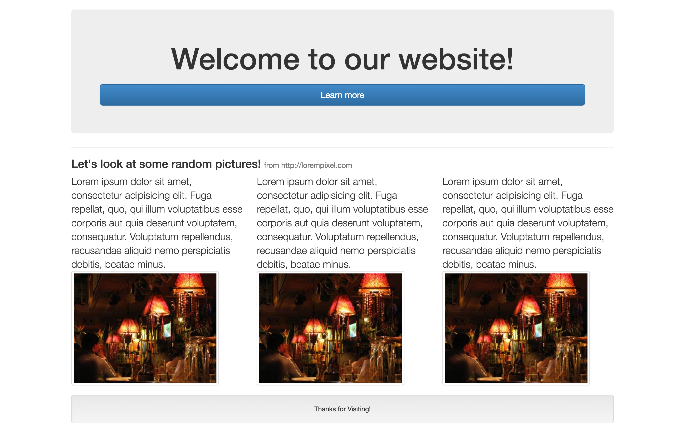
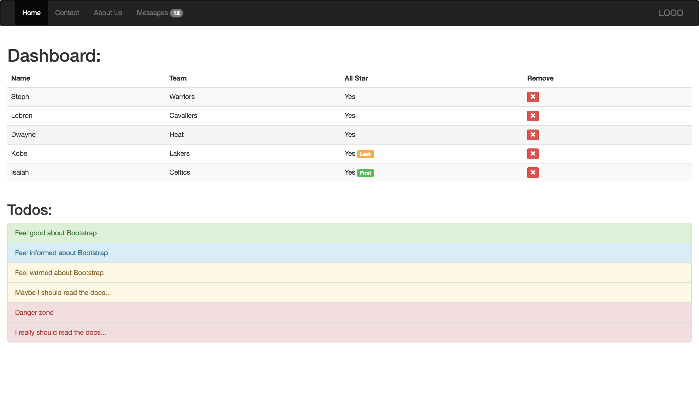

# Core Blocks

In the following challenges you will be:
- Building a responsive grid system
- Build some Bootstrap webpages

For the Release 1 and 2 you should only use Twitter Bootstrap and [lorem pixel](http://lorempixel.com/) for placeholder images.

## Releases:

## Release 0:

For this exercise you will be building a small grid system! Your task is to create the following classes:

`.col-4` - consumes 33% of the width when the screen size is greater than 960 pixels, 50% of the width when the screen size is greater than 765 pixels and 100% of the width when the screen size is less than 765 pixels.

`.col-6` - consumes 50% of the width when the screen size is greater than 960 pixels and 100% of the width when the screen size is less than 960 pixels

`.col-12` - consumes 100% of the width when the screen size at all sizes.

## Release 1:

Write the necessary code to make your page look just like this one:

## Release 2: 
Write the necessary HTML to make your page look just like this one:

